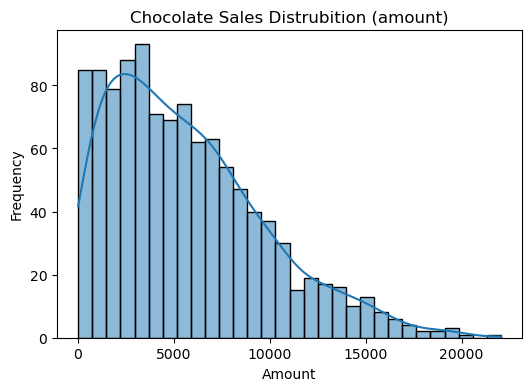
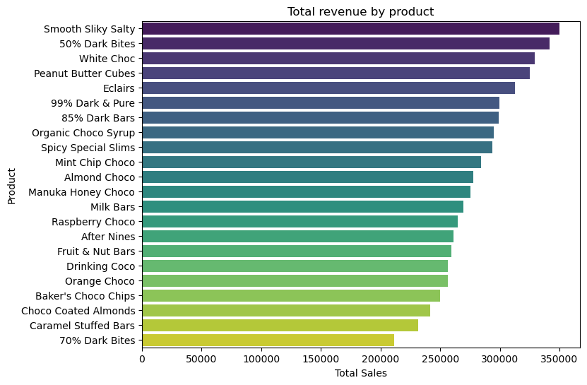
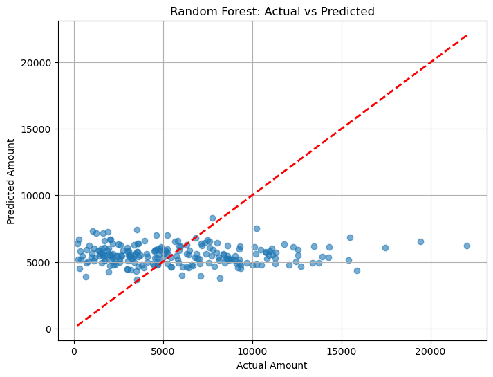

# Chocolate Sales Prediction with Machine Learning

This project explores chocolate sales data and applies machine learning models to predict sales revenue (`amount`) based on features like product type, number of boxes shipped, salesperson, and country.

## Dataset

- **Source**: [Kaggle - Chocolate Sales Dataset](https://www.kaggle.com/datasets/atharvasoundankar/chocolate-sales)
- **Records**: 1094
- **Features**: Sales Person, Country, Product, Date, Amount (target), Boxes Shipped

## Project Structure

1. **Data Loading and Preprocessing**
   - Importing libraries
   - Reading and cleaning the dataset
   - Handling currencies and dates
   - Feature engineering (e.g. extracting date parts)
   - One-hot encoding of categorical features

2. **Exploratory Data Analysis (EDA)**
   - Visual analysis by product, country, month, day of week, and salesperson
   - Distribution analysis of the target variable (`amount`)
   - Business insights on top products and performers
   
     

   *Distribution of the target variable `amount` — most values fall under 8000 with a long right tail*

   

   *Total revenue by product — Smooth Silky Salty and 50% Dark Bites are top sellers*

4. **Modeling**
   - Feature selection and data splitting
   - Training Random Forest and Gradient Boosting models
   - Hyperparameter tuning (tree depth)
   - Evaluation using MAE, RMSE, and R² metrics

## Modeling Results

1. **Metrics Summary**
Best performance: **Random Forest Regressor** with depth = 5  
   - **MAE** ≈ 3256  
   - **RMSE** ≈ 4071  
   - **R²** ≈ -0.02

2 **Actual vs Predicted Revenue**
This scatter plot shows how close the predicted values are to the actual sales amounts.
The model tends to predict values near the average — indicating underfitting.

## Insights

   - Top products: *Smooth Silky Salty*, *50% Dark Bites*
   - Best-performing countries: *Australia*, *UK*, *India*, *USA*
   - Most successful salespersons: *Chess Bonnell*, *Oby Sorrel*
   - Sales mostly occurred on weekdays, with *Thursday* and *Tuesday* being strongest

## Key Takeaway

- The models struggled to accurately predict `amount`, often regressing to the mean.
- Feature importance suggests that `boxes shipped` is the strongest predictor.
- Further improvements require more features or external data (e.g. marketing efforts, seasonality, prices).

## Files

- `chocolate_sales_ml.ipynb` — Main analysis and modeling notebook  
- `README.md` — Project description and summary of results  
- `images/` — Folder containing all visualizations used in the analysis and README  
   - `amount_distribution.png`  
   - `sales_by_product.png`  
   - `actual_vs_predicted.png`

## Technologies Used

- Python (Pandas, NumPy, Matplotlib, Seaborn, Scikit-learn)
- Jupyter Notebook
- Random Forest & Gradient Boosting Regressors

## Future Improvements

- Add external data sources to enrich features
- Try advanced models like XGBoost or LightGBM
- Build a web dashboard for interactive analysis

---

**Author**: Nadya Antonova  
**Date**: October 2025
